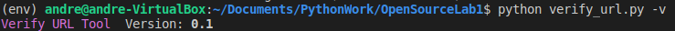
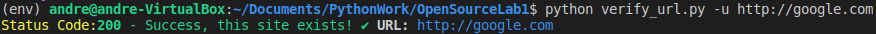
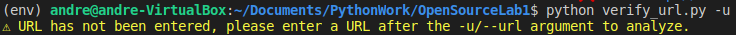

# Verify-URL

**Brief Description: A Python script that verifies the return code of URLs.**

## Detailed Description:

This is a script that will run a list or a single URL and will tell you the return code.

We can use this tool in multiple ways. To begin, if the user types in the code to run the program without any arguments, they will be displayed the default help message. Typing `-h/--help` will accomplish the same thing.


If we want to check the version we can do so by typing `-v/--version` to check the version.



Next, if we want to just verify a single url, we can do this by using the `-u/--url` argument (followed by a string with the format http:// or https:// ):



If we write the `-u/--url` argument without a valid link, it will give us a warning.



Now, as for the default main core of the program, the idea was to build a tool that can analyze a full **list** of URLs. In order to perform this, we need to enter a valid html file after invoking the program.


As we can see, several things are implemented here:

- Color for different request code ranges
- Error handling for Connections that are refused
- If a connection takes longer than 5s to connect, it will be timed out - because no one wants to wait forever...

## Getting Started

These instructions will get you a copy of the project up and running on your local machine for development and testing purposes.

### Prerequisites

You will need to install python3

---

You may or may not need to set up a virtual environment depending on your OS. If you want to set up a Virtual Environment, you will have to type the following:

```shell
    python3 -m venv .venv
```

The above line should <u>only</u> be ran **the first time** you set up your folder

Once it has been created, you will want to run the source command:

```shell
    source [location_of_your_folder/.venv/bin/activate]
```

You will know if it worked or not if you see `(.venv)` infront of where you would input your command line operations. (Just see the pictures above, it should look similar.)

---

After that, you'll want to install the libraries

```shell
    pip3 install -r requirements.txt
```

Make sure to use latest version of UTF encoding to get the proper emojis for the script responses.

### Development Setup

To run this program, we will need to use a terminal that supports Bash Scripting and Python. This application is best used on a Linux Terminal.

Open it in a terminal and call it via the command line, see the detailed description for further instruction.

## Libraries or frameworks

- [Requests](https://requests.readthedocs.io/en/master/) - Used for getting the request codes.
- [Beautiful Soup](https://www.crummy.com/software/BeautifulSoup/bs4/doc/) - Used for parsing HTML in Python
- [lxml](https://lxml.de/) - Used for processing HTML and XML files in Python, used in conjunction with Beautiful Soup
- [Argparse](https://docs.python.org/3/library/argparse.html) - Used for parsing arguments
- [Sys](https://docs.python.org/3/library/sys.html) - Used for calling objects from the system

## Contributing

Please read [CONTRIBUTING.md](https://gist.github.com/PurpleBooth/b24679402957c63ec426) for details on the code of conduct, and the process for submitting pull requests.

## Versioning

Version 0.1 - Stable Release. Features listed in the Detailed Description.

## Authors

- **Andre Bhaseen** - _Initial work_ - [abhaseen](https://github.com/abhaseen)

## License

This project is licensed under the MIT License - see the [LICENSE.md](LICENSE.md) file for details

[//]: # "## Acknowledgements"
